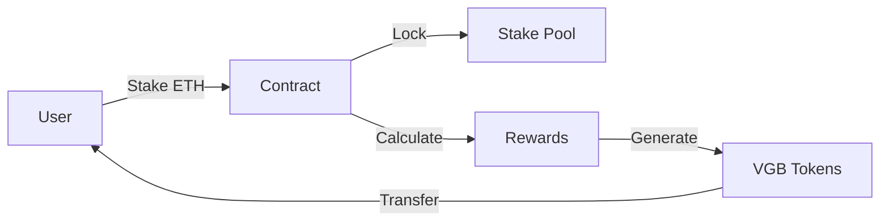

<div align="center">

```ascii
  _____ _   _              __     __         _ _ 
 | ____| |_| |__   ___ _ _\ \   / /_ _ _   _| | |_ 
 |  _| | __| '_ \ / _ \ '__\ \ / / _` | | | | | __|
 | |___| |_| | | |  __/ |   \ V / (_| | |_| | | |_ 
 |_____|\__|_| |_|\___|_|    \_/ \__,_|\__,_|_|\__|
```

# Ethereum Staking Platform with VGB Rewards

> Stake ETH. Earn VGB. DeFi Made Simple.

[](https://sepolia.etherscan.io/address/0xd01c85418F6Bf3b945ea1668E4Dfd4D4361Ab58D)
[](https://www.youtube.com/watch?v=XYssCK5NHHk)

</div>

## 📝 Overview

EtherVault is a decentralized staking platform where users can:
- Stake ETH (minimum 0.01 ETH)
- Earn VGB tokens as rewards (10% APR)
- Withdraw anytime
- Claim rewards on demand

## 🔄 How It Works



## 💎 Core Features

### Smart Contract (`StakingContract.sol`)
```solidity
contract StakingContract is ReentrancyGuard, Pausable, Ownable {
    uint256 public constant REWARD_RATE = 10; // 10% APR
    uint256 public constant MINIMUM_STAKE = 0.01 ether;
    
    struct Stake {
        uint256 amount;
        uint256 timestamp;
    }
    
    mapping(address => Stake) public stakes;
    uint256 public totalStaked;
}
```

### Key Functions

```solidity
function stake() external payable;       // Stake ETH
function unstake() external;             // Withdraw ETH + Rewards
function calculateReward(address user) public view returns (uint256);
function getStakedBalance(address user) external view returns (uint256);
```

## 💰 Reward System

Rewards are calculated using a time-weighted formula:

```js
reward = (stakedAmount * REWARD_RATE * stakingDuration) / (365 days * 100)
```

### Example Rewards

## 🎥 Demo

<div align="center">
  <a href="https://www.youtube.com/watch?v=XYssCK5NHHk">
    
  </a>
</div>

## 💫 Features

<div align="center">
  <table>
    <tr>
      <td align="center">
        <br/>
        <b>Stake ETH</b><br/>
        <small>Min 0.01 ETH</small>
      </td>
      <td align="center">
        <br/>
        <b>Earn VGB</b><br/>
        <small>10% APR</small>
      </td>
      <td align="center">
        <br/>
        <b>Daily Rewards</b><br/>
        <small>Auto-compound</small>
      </td>
      <td align="center">
        <br/>
        <b>Secure</b><br/>
        <small>Audited</small>
      </td>
    </tr>
  </table>
</div>

## 🔥 Core Technology

```solidity
// Stake ETH, earn VGB rewards
contract StakingContract {
    uint256 public constant REWARD_RATE = 10; // 10% APR
    uint256 public constant MINIMUM_STAKE = 0.01 ether;
    
    mapping(address => uint256) public Balances;
    
    function stake() external payable;
    function unstake(uint256 _amount) external;
    function getRewards(address _address) external view returns (uint256);
    function claimRewards() external;
}
```

## 🎮 Interactive Interface

<div align="center">
  
</div>

## 📊 Reward System

```js
// Example: Stake 1 ETH for 30 days
const calculation = {
  stake: 1,              // ETH
  duration: 30,          // days
  apr: 10,              // %
  reward: 0.0082        // ETH worth of VGB
};
```

<div align="center">
  <table>
    <tr>
      <th>Stake Amount</th>
      <th>Duration</th>
      <th>VGB Rewards</th>
    </tr>
    <tr>
      <td>1 ETH</td>
      <td>30 days</td>
      <td>0.0082 ETH ≈ VGB</td>
    </tr>
    <tr>
      <td>5 ETH</td>
      <td>30 days</td>
      <td>0.041 ETH ≈ VGB</td>
    </tr>
    <tr>
      <td>10 ETH</td>
      <td>30 days</td>
      <td>0.082 ETH ≈ VGB</td>
    </tr>
  </table>
</div>

## 🚀 Quick Start

```bash
# Clone repository
git clone https://github.com/VagabondBushido/Ether-Vault.git

# Frontend setup
cd frontend
npm install
npm run dev

# Smart contract setup
cd backend
forge install
forge build
```

## 🔐 Deployment

- **Network**: Sepolia Testnet
- **Staking Contract**: `0xd01c85418F6Bf3b945ea1668E4Dfd4D4361Ab58D`
- **VGB Token**: [View on Etherscan](https://sepolia.etherscan.io)

## 🛡️ Security

- ✅ Reentrancy Guard
- ✅ Pausable
- ✅ Access Control
- ✅ Emergency Withdraw
- ✅ Integer Overflow Protection

## 🛠️ Built With

<div align="center">
  <table>
    <tr>
      <td align="center">
        
        <br>Solidity
      </td>
      <td align="center">
        
        <br>React
      </td>
      <td align="center">
        
        <br>TypeScript
      </td>
    </tr>
  </table>
</div>

---

<div align="center">
  <br/>
  <p>
    <a href="https://twitter.com/VagabondBushido">
      
    </a>
    <a href="https://discord.gg/ethervault">
      
    </a>
  </p>
  <p>Made with ❤️ by VagabondBushido</p>
</div> 