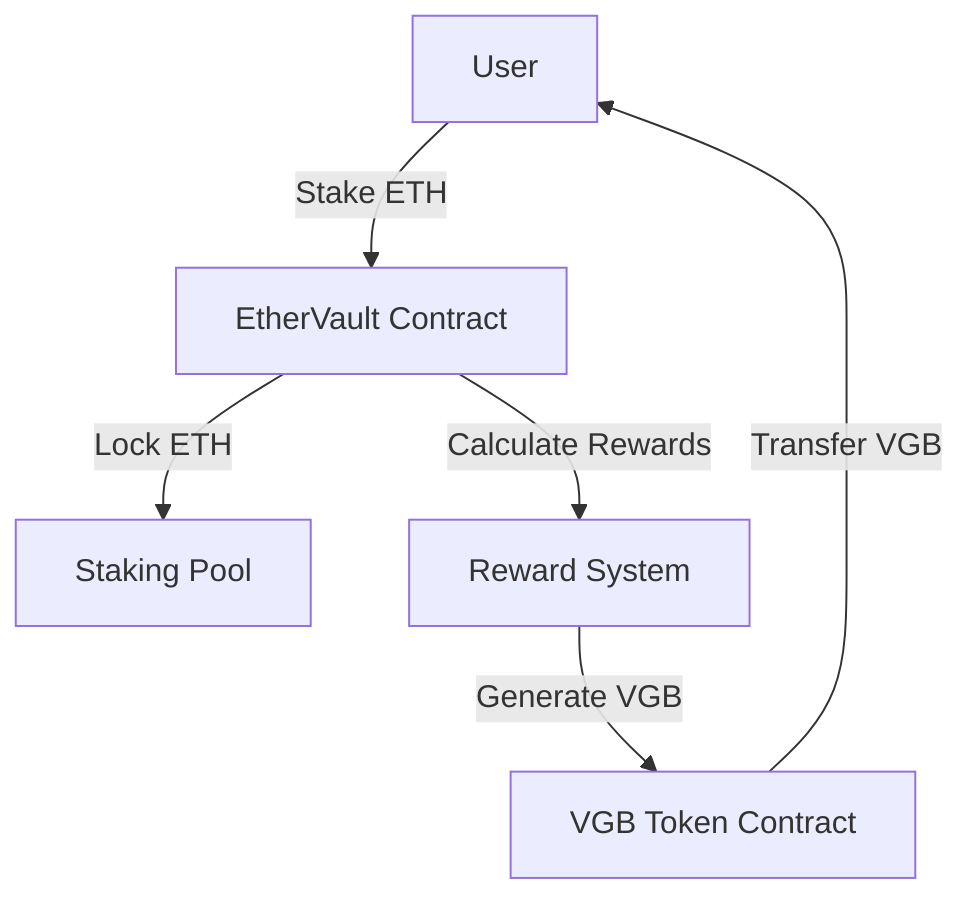
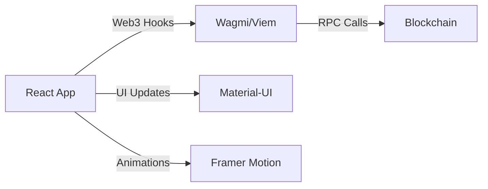

# EtherVault 🏦

<div align="center">


[](https://docs.soliditylang.org/)
[](https://reactjs.org/)
[](https://ethereum.org/)
[](https://opensource.org/licenses/MIT)

<p align="center">
  <strong>Stake ETH. Earn VGB. Simple as that. 🚀</strong>
</p>

<p align="center">
  <a href="#-quick-start">Quick Start</a> •
  <a href="#-features">Features</a> •
  <a href="#-architecture">Architecture</a> •
  <a href="#-rewards">Rewards</a> •
  <a href="#-technical-details">Technical Details</a>
</p>

</div>

## 🚀 Quick Start

```bash
# Clone the repository
git clone https://github.com/yourusername/ethervault.git

# Install frontend dependencies
cd frontend
npm install

# Install backend dependencies
cd ../backend
forge install

# Start frontend development server
cd ../frontend
npm run dev
```

## ✨ Features

### 🔐 Secure Staking
- Stake any amount of ETH
- Smart contract security best practices
- Real-time balance updates
- Transparent transaction processing

### 💎 VGB Rewards
- Earn VGB tokens for staking
- Time-weighted reward calculations
- Automatic reward accrual
- Claim rewards anytime

### 🎨 Modern UI/UX
- Intuitive interface
- Real-time animations
- Clear visual feedback
- Mobile-responsive design

## 🏗 Architecture

### Smart Contract Architecture


### Frontend Architecture


## 💰 Rewards System

### Calculation Formula
VGB rewards are calculated using the following formula:

\`\`\`math
Rewards = StakedAmount * TimeStaked * RewardRate
\`\`\`

Where:
- StakedAmount: Amount of ETH staked
- TimeStaked: Duration of stake in blocks
- RewardRate: Current VGB/ETH reward rate

### Example Calculation
```typescript
// Example for 1 ETH staked for 30 days
const rewardRate = 0.001; // VGB per ETH per block
const blocksPerDay = 7200; // Approximate blocks per day on Sepolia
const timeStaked = 30 * blocksPerDay;
const stakedAmount = 1;

const rewards = stakedAmount * timeStaked * rewardRate;
// = 1 * (30 * 7200) * 0.001
// = 216 VGB
```

## 🔧 Technical Details

### Contract Addresses (Sepolia)
- EtherVault: \`0xd01c85418F6Bf3b945ea1668E4Dfd4D4361Ab58D\`

### Smart Contract Functions

#### Staking Functions
\`\`\`solidity
function stake() external payable
function withdraw(uint256 amount) external
function getStakedBalance(address user) external view returns (uint256)
\`\`\`

#### Reward Functions
\`\`\`solidity
function getRewardBalance(address user) external view returns (uint256)
function claimRewards() external
\`\`\`

### Frontend Integration

#### Wallet Connection
```typescript
const { connect, isConnected } = useConnect({
  connector: new InjectedConnector(),
});
```

#### Contract Interaction
```typescript
const { data: stakedBalance } = useContractRead({
  address: CONTRACT_ADDRESS,
  abi: CONTRACT_ABI,
  functionName: 'getStakedBalance',
  args: [address],
});
```

## 🎯 Implementation Details

### Backend (Smart Contracts)

The backend consists of two main contracts:
1. **EtherVault Contract**: Handles ETH staking and reward calculations
2. **VGB Token Contract**: ERC20 token for rewards

Key features:
- Secure staking mechanism
- Time-weighted reward calculation
- Gas-optimized operations
- Emergency withdrawal functionality
- Event emission for frontend tracking

### Frontend (React)

Built with modern React and Web3 libraries:
- **State Management**: React Hooks + Context
- **Blockchain Integration**: Wagmi/Viem
- **UI Framework**: Material-UI
- **Animations**: Framer Motion

Features:
- Real-time balance updates
- Transaction status tracking
- Network detection
- Error handling
- Responsive design

## 🔐 Security

### Smart Contract Security
- Reentrancy protection
- Integer overflow checks
- Access control
- Emergency pause functionality
- Event emission for transparency

### Frontend Security
- Network validation
- Transaction confirmation
- Error boundary implementation
- Secure key storage

## 🚀 Development

### Prerequisites
- Node.js >= 16
- Git
- Foundry
- MetaMask wallet

### Environment Setup
Create `.env` in frontend directory:
```bash
VITE_ALCHEMY_API_KEY=your_alchemy_key
```

### Running Tests
```bash
# Smart Contract Tests
cd backend
forge test

# Frontend Tests
cd frontend
npm test
```

## 📱 UI Components

### Main Dashboard
- Wallet balance display
- Staked amount tracker
- Reward balance viewer
- Action buttons

### Staking Interface
- Amount input
- Confirmation dialog
- Transaction status
- Balance updates

### Rewards Panel
- Current rewards
- Claim button
- History view
- Analytics

## 🤝 Contributing

1. Fork the repository
2. Create feature branch
3. Commit changes
4. Push to branch
5. Open pull request

## 📄 License

MIT License - see [LICENSE](LICENSE) for details

---

<div align="center">
  Made with ❤️ by the EtherVault Team
</div> 