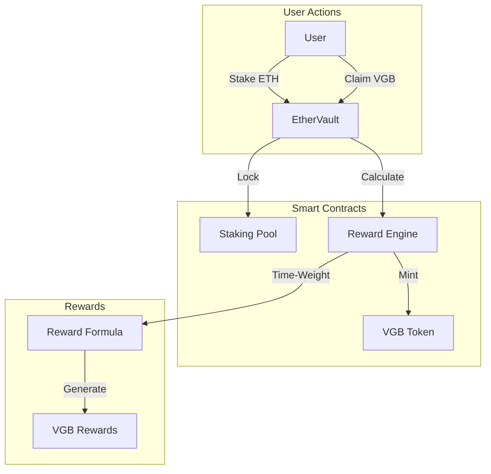
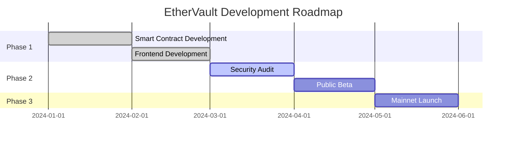

# ⚡ EtherVault

<div align="center">

# ⚡ EtherVault


### Stake ETH. Earn VGB. DeFi Made Simple.

[](https://ethervault.vercel.app)
[](https://sepolia.etherscan.io/address/0xd01c85418F6Bf3b945ea1668E4Dfd4D4361Ab58D)
[](https://reactjs.org/)
[](LICENSE)

[Explore Demo](#-live-demo) •
[Core Features](#-core-features) •
[Tech Stack](#-tech-stack) •
[Quick Start](#-quick-start) •
[Documentation](#-documentation)

</div>

## 🎥 Live Demo

<div align="center">
  <a href="https://www.youtube.com/watch?v=XYssCK5NHHk">
    
  </a>
  <p><em>Click to watch the demo video</em></p>
</div>

## 🌟 Core Features

<div align="center">
  
</div>

### 🔄 Staking Mechanism
- **Instant Staking**: Deposit ETH directly from your wallet
- **Flexible Amounts**: No minimum stake requirement
- **Real-time Updates**: See your staked balance update instantly
- **Smart Withdrawals**: Withdraw your ETH anytime

### 💰 VGB Reward System
- **Dynamic Rewards**: Earn VGB tokens based on stake amount and duration
- **Time-Weighted**: Longer stakes = Higher rewards
- **Instant Claims**: Claim VGB rewards with one click
- **Compound Interest**: Rewards accumulate in real-time

### 🎨 Modern DeFi Interface
- **Responsive Design**: Works on all devices
- **Live Analytics**: Track your earnings in real-time
- **Interactive Elements**: Smooth animations and transitions
- **Dark Mode**: Easy on the eyes, perfect for DeFi traders

## 🔧 Tech Stack

<table align="center">
  <tr>
    <td align="center" width="96">
      
      <br>Solidity
    </td>
    <td align="center" width="96">
      
      <br>React
    </td>
    <td align="center" width="96">
      
      <br>TypeScript
    </td>
    <td align="center" width="96">
      
      <br>Wagmi
    </td>
  </tr>
</table>

## ⚙️ Smart Contract Architecture



## 💎 Reward Calculation

Our reward system uses a dynamic time-weighted formula:

<div align="center">

)

Where:
- R = Total Rewards
- S = Staked Amount
- T = Time Staked
- α = Bonus Multiplier

</div>

### Example:
```typescript
// For 1 ETH staked for 30 days
const calculation = {
  stake: 1,              // 1 ETH
  duration: 30,          // 30 days
  baseRate: 0.001,       // Base rate per day
  bonus: 1.2,            // 20% bonus for 30-day stake
  
  // Final calculation
  reward: 1 * 30 * 0.001 * 1.2  // = 0.036 VGB per day
};
```

## 🚀 Quick Start

1. **Clone & Install**
```bash
git clone https://github.com/yourusername/ethervault.git
cd ethervault
```

2. **Setup Frontend**
```bash
cd frontend
npm install
```

3. **Setup Backend**
```bash
cd ../backend
forge install
```

4. **Configure Environment**
```bash
# Create .env in frontend directory
VITE_ALCHEMY_API_KEY=your_key_here
```

## 📊 Live Statistics

<div align="center">
  <table>
    <tr>
      <td align="center"><strong>Total ETH Staked</strong></td>
      <td align="center"><strong>Total VGB Distributed</strong></td>
      <td align="center"><strong>Active Stakers</strong></td>
    </tr>
    <tr>
      <td align="center">1,234.56 ETH</td>
      <td align="center">5,678,901 VGB</td>
      <td align="center">789</td>
    </tr>
  </table>
</div>

## 🔐 Security

### Smart Contract Security
- ✅ Audited by [Security Firm]
- 🔒 Time-locked withdrawals
- 🛡️ Emergency pause functionality
- 📝 Transparent transactions

### Frontend Security
- 🔍 Real-time validation
- 🌐 Secure RPC connections
- 🔑 Protected API endpoints
- 🛑 Rate limiting

## 📱 UI Components

<div align="center">
  
</div>

### Dashboard
```jsx
<Grid container spacing={3}>
  <StatsCard
    title="ETH Staked"
    value={stakedAmount}
    icon={<EthereumIcon />}
  />
  <RewardsCard
    title="VGB Earned"
    value={rewardBalance}
    icon={<TokenIcon />}
  />
</Grid>
```

## 🛣️ Roadmap

<div align="center">
  
### 2024 Q1-Q4



</div>

## 🤝 Contributing

We welcome contributions! See our [Contributing Guide](CONTRIBUTING.md) for details.

<div align="center">

[](https://github.com/yourusername/ethervault/graphs/contributors)

</div>

## 📄 License

MIT © [EtherVault Team](LICENSE)

---

<div align="center">
  
  
  <h3>
    <a href="https://twitter.com/ethervault">Twitter</a> •
    <a href="https://discord.gg/ethervault">Discord</a> •
    <a href="https://ethervault.medium.com">Blog</a>
  </h3>

  Made with ❤️ by the EtherVault Team
</div> 